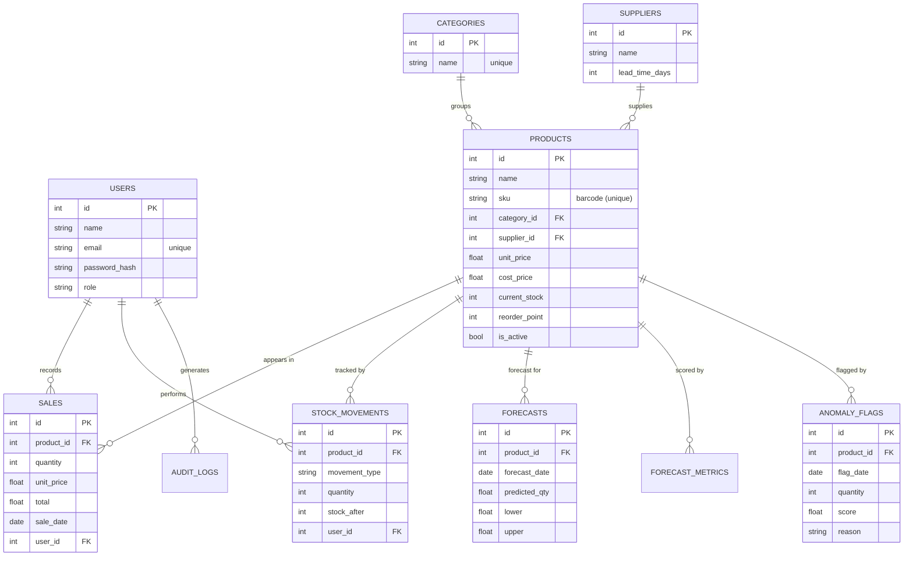

# Database design — Ransbet IIMS

Everything about the data layer: where it's defined, the tables, the relationships,
how to view it, and how to answer examiner questions about it.

---

## 1. Where the "database code" lives

There are **two** views of the database, and you can show both:

1. **`app/models.py`** — the tables defined as Python classes using the **SQLAlchemy
   ORM** (Object-Relational Mapper). This is the source of truth. Each class is a
   table; each attribute is a column.
2. **`docs/schema.sql`** — the equivalent **raw MySQL `CREATE TABLE` statements**,
   generated from those models. This is the actual SQL the database runs.

> **Why an ORM instead of writing SQL by hand?** The ORM lets us define each table
> once, in Python, and works with any SQL database (we developed on SQLite and
> deployed on MySQL with no code change). It also prevents SQL-injection attacks
> because queries are parameterised automatically. The ORM *generates* the SQL for
> us — `schema.sql` shows exactly what it produced.

We use **MySQL 8.0**, a relational database, because the data is highly structured
and related (products, sales, suppliers), benefits from foreign keys and indexing,
and MySQL is the industry standard for transactional business systems.

---

## 2. Entity-Relationship (ER) diagram



*(This diagram renders automatically on GitHub. `||--o{` means "one-to-many": one
product has many sales, one supplier supplies many products, and so on.)*

---

## 3. The tables (10)

| Table | What it stores | Important columns | Links to |
|-------|----------------|-------------------|----------|
| `users` | Login accounts & roles | email (unique), password_hash, role | — |
| `categories` | Product groupings | name (unique) | — |
| `suppliers` | Supplier details | name, contact, lead_time_days | — |
| `products` | The catalogue | name, sku (barcode), unit_price, current_stock, reorder_point | category_id→categories, supplier_id→suppliers |
| `sales` | Each sale (forecast dataset) | quantity, unit_price, total, sale_date | product_id→products, user_id→users |
| `stock_movements` | Inventory ledger | movement_type, quantity, stock_after | product_id→products, user_id→users |
| `forecasts` | Predicted daily demand | forecast_date, predicted_qty, lower, upper | product_id→products |
| `forecast_metrics` | Model accuracy per product | mape, mae, rmse | product_id→products |
| `anomaly_flags` | Unusual events | flag_date, quantity, score, reason | product_id→products |
| `audit_logs` | Action history | action, description, created_at | user_id→users |

`→` = foreign key.

---

## 4. Keys, relationships & indexes

- **Primary key**: every table has an auto-incrementing `id`.
- **Foreign keys** enforce relationships (e.g. a sale must belong to a real product).
- **Unique constraints**: `users.email`, `products.sku`, `categories.name` — prevents
  duplicate accounts, barcodes or categories.
- **Indexes** on the most-queried columns (`products.name`, `sales.sale_date`,
  `sales.product_id`, `forecasts.product_id+forecast_date`, etc.) keep queries fast as
  the data grows — exactly what the report's performance requirement asks for.
- **Normalisation**: categories and suppliers are separate tables referenced by id,
  rather than repeating their text in every product row (third-normal-form design).

---

## 5. How to view the database live (for the demo)

**Option A — SQLTools in VS Code** (already set up): left sidebar → SQLTools →
"Ransbet IIMS (MySQL)" → Connect → expand the database → click any table.

**Option B — MySQL command line:**
```bash
mysql -u root -p ransbet_iims
SHOW TABLES;
DESCRIBE products;
```

### Sample queries to run live
```sql
-- All products with stock and reorder level
SELECT name, current_stock, reorder_point FROM products ORDER BY name;

-- Items that need reordering
SELECT name, current_stock, reorder_point
FROM products WHERE current_stock <= reorder_point;

-- Total revenue per day (last 7 days)
SELECT sale_date, SUM(total) AS revenue
FROM sales GROUP BY sale_date ORDER BY sale_date DESC LIMIT 7;

-- Top 5 best-selling products
SELECT p.name, SUM(s.quantity) AS units_sold
FROM sales s JOIN products p ON p.id = s.product_id
GROUP BY p.name ORDER BY units_sold DESC LIMIT 5;
```

---

## 6. Database questions you might be asked (with answers)

**Q: Show me your database design / schema.**
A: Open `app/models.py` (the table definitions) and `docs/schema.sql` (the SQL), then
show the live tables in SQLTools. The ER diagram is in `docs/DATABASE.md`.

**Q: Did you write the SQL yourself?**
A: We defined the tables in Python using the SQLAlchemy ORM, which generates the SQL.
`schema.sql` is that generated SQL. The ORM gives us database independence and
protects against SQL injection.

**Q: How are the tables related?**
A: Through foreign keys. For example, every `sales` row has a `product_id` pointing to
a `products` row; products point to a category and a supplier. One-to-many throughout.

**Q: How do you keep it fast with lots of data?**
A: Indexes on the columns we filter and join on (product id, dates, names), and a
normalised design so data isn't duplicated.

**Q: How do you prevent duplicate products or users?**
A: Unique constraints on `products.sku` (barcode) and `users.email`.

**Q: Why MySQL and not, say, a spreadsheet or NoSQL?**
A: The data is structured and relational, needs reliable transactions (a sale must
update stock atomically), and must enforce relationships — exactly what a relational
database like MySQL is built for.

**Q: How does the app talk to the database?**
A: Through the SQLAlchemy ORM in the Flask backend. The frontend never touches the
database directly — it asks the backend, which runs the query and returns JSON.
```python
# Example from the code (recording a sale):
db.session.add(Sale(product_id=p.id, quantity=qty, unit_price=price, total=price*qty))
p.current_stock -= qty            # update stock
db.session.commit()               # save it all in one transaction
```
